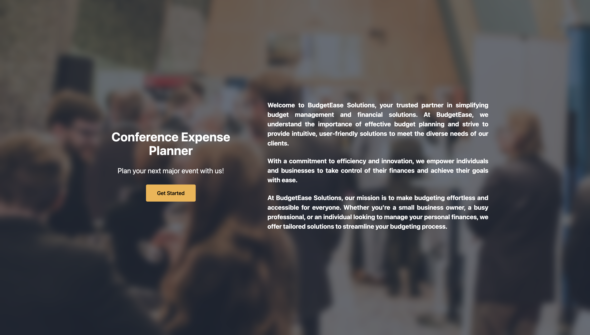

# Conference Event Planner

This is a project based on the practice project for the learning with react course from the IBM FullStack Development Course.

## Overview
Alejandre manages a venue for business conferences. Her parent company, "BudgetEase" wants to hire you to develop a website so BudgetEase customers can price their conference events easily.

The application's requirements include allowing users to select and price the rooms in the conference center, add-on selections, like microphones and projectors, and meals for a given number of guests.

## Technologies Used
- Environment:
    - NodeJS: <= 23.2.0
    - Vite: <= 5.2.0 
- Framework:
    - React: <= 18.2.0
- libraries:
    - Redux: <= 9.1.1

## Features

The BudgetEase conference expense planner features will include:

- A dynamic user interface that updates in real time based on user selections
- Components for venue selection, add-ons, and meal options
- Redux integration using Redux Toolkit to manage state changes
- Redux slices to manage different section states
- Display selected items and their costs with a table in a pop-up window
- Calculate and display subtotals and total costs based on user selections

## Contributors

- IBM Skill Network - [IBM Skill Network](https://github.com/ibm-developer-skills-network)

- Ben Karanja - [bernie-haxx](https://github.com/bernie-haxx)

## Template Used

The template source is located [here](https://github.com/ibm-developer-skills-network/conference_event_planner.git
)

## Feedback
If you have any feedback, suggestions, or issues with the application, please feel free to [open an issue](https://github.com/bernie-haxx/Conference-event-planner/issues). We welcome contributions and collaboration to make Travel Bloom even better!